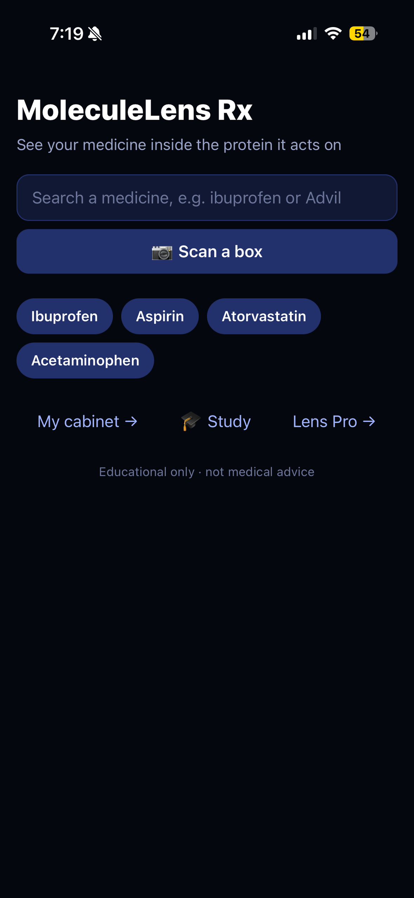
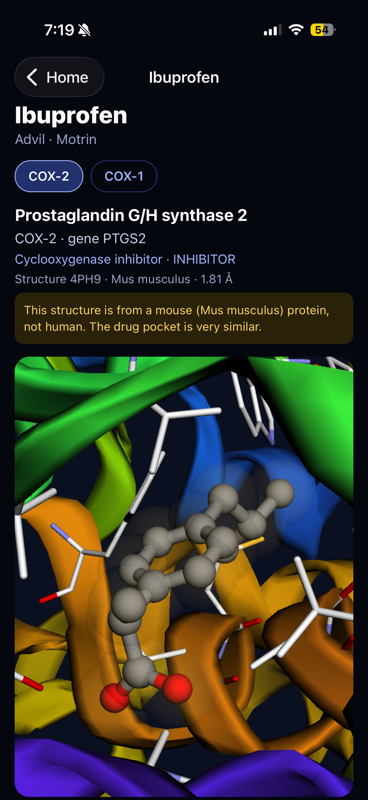
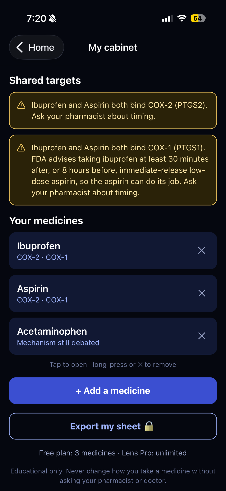
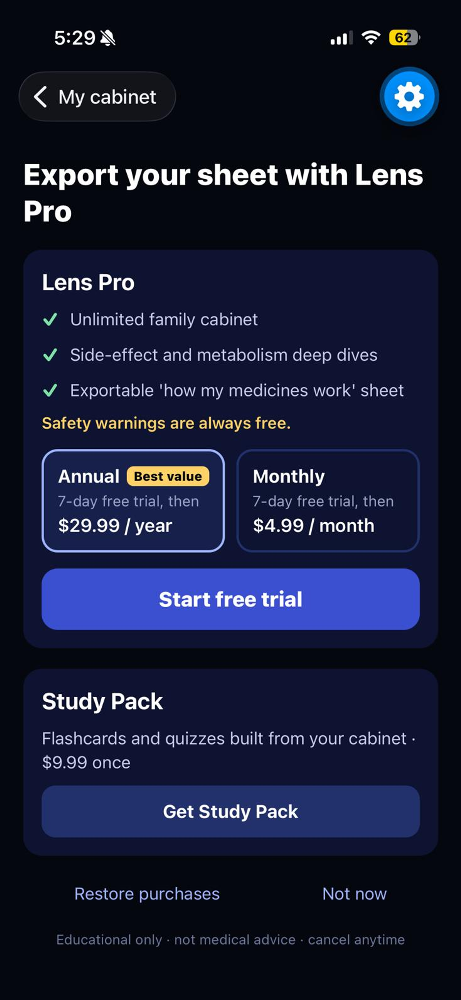
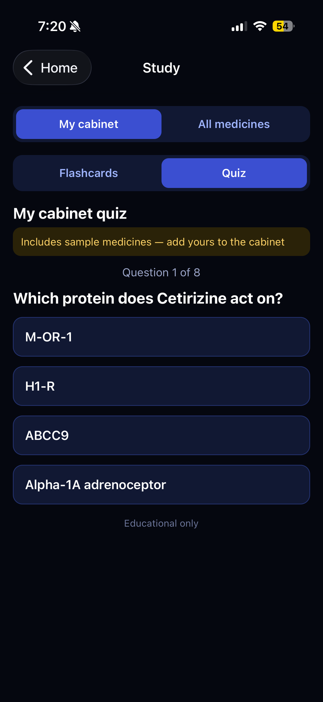
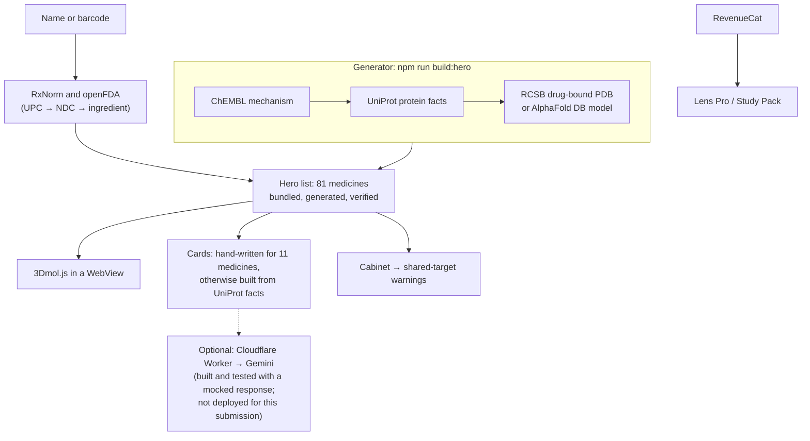

# MoleculeLens Rx

Scan or search a medicine and see it sitting inside the protein it acts on — in interactive 3D, with a plain-language explanation, plus warnings when two of your medicines hit the same protein.

    

▶️ [Demo video](VIDEO_URL) · Built for RevenueCat Shipaton 2026 (Next Gen Award)

| Home | Target screen | Cabinet | Paywall | Study |
|---|---|---|---|---|
|  |  |  |  |  |

## What it does

1. **Search or scan.** Type a generic or brand name ("Advil", "atorvastatin"), or point the camera at the barcode on a US medicine box. The app turns the UPC into a National Drug Code and asks openFDA, then RxNorm if openFDA has no match.
2. **Target screen.** You see the protein the medicine acts on, in 3D. Where a drug-bound structure exists, the drug glows inside its pocket; drag to rotate, pinch to zoom, and use the buttons to re-centre or switch between ribbon and surface.
3. **Three cards.** "What the protein normally does", "What the drug changes", and "Why that helps — and can cause side effects". They are hand-written for 11 medicines and built from UniProt and ChEMBL facts for the rest.
4. **Cabinet with shared-target warnings.** Save the medicines you take. If two of them act on the same protein, an amber warning says so and tells you to ask your pharmacist; ibuprofen plus aspirin also shows the FDA timing advice.
5. **Study mode.** Flashcards and a quiz built from your cabinet, or from all 81 medicines. Each medicine yields several card and question types, and a small cabinet is topped up with sample medicines so there is always enough to practise.

## Honesty & safety

- Educational only. The app never gives doses and never tells you to start, stop or change a medicine.
- Every warning ends with "Ask your pharmacist".
- Animal structures are flagged. For example, 4PH9 is ibuprofen bound to **mouse** COX-2; the screen says so.
- Acetaminophen and metformin show "Mechanism still debated" instead of a forced protein.
- Germ targets are labelled: "This protein belongs to *Escherichia coli*, not to you — the medicine attacks the germ." Antibiotics that jam the whole bacterial ribosome say there is no single protein to show.
- Ingredients with no protein mechanism (guaifenesin) say they work physically or chemically, with nothing to show in 3D.
- **The AI never picks the protein.** Every target comes from ChEMBL and UniProt through `scripts/build-hero-list.mjs`. Each run writes [`scripts/verification-report.md`](scripts/verification-report.md), which I reviewed row by row; flagged rows were fixed or explained.

## How it works



- The hero list is generated ahead of time and bundled, so search is instant and every fact was reviewed before it shipped. Structure files are downloaded from RCSB or AlphaFold when you open a medicine.
- Numbers today: 81 medicines; 11 with a drug-bound PDB structure (4PH9, 5F19, 3NT1, 3LN1, 1HWK, 1HW9, 1O86, 1PXX, 4M11, 1HWL, 1UDT — five of them mouse COX-2, six human); AlphaFold predicted models for most other targets; 9 medicines that act on 13 germ proteins or machines.
- The Gemini Worker (`worker/`) is built and tested with a mocked Gemini response. It is not deployed for this submission because the Gemini API key requires an 18+ Google account. Without it the app shows the hand-written or fact-built text, captioned "Built from verified facts (ChEMBL · UniProt)".

## RevenueCat

- **Setup:** RevenueCat Test Store, which works inside Expo Go with a `test_` key. Offering `default` with three packages.
- **Products:** `lens_pro_monthly` ($4.99/month) and `lens_pro_yearly` ($29.99/year), both with a 7-day free trial; `study_pack` ($9.99, non-consumable).
- **Entitlements:** `pro` (either subscription) and `study` (Study Pack).
- **Custom paywall:** RevenueCat's prebuilt Paywalls show a placeholder in Expo Go, so the paywall is our own screen. It shows trial copy only when the store reports an intro offer.
- **Free:** unlimited lookups, the 3D view, the three cards, a cabinet of up to 3 medicines, and **every** shared-target warning. Safety information is never paywalled.
- **Lens Pro:** unlimited cabinet and the side-effect and metabolism deep dives.
- **Study Pack:** flashcards and quizzes.
- **Expo Go quirk:** the customer-info update listener never fires in Expo Go, so after every purchase or restore the app re-fetches `getCustomerInfo()` and refreshes entitlements.

## Run it

Prerequisites: Node 24, the Expo Go app on your phone, and a free Expo account.

```bash
git clone https://github.com/sarayu-b/moleculelens-rx.git
cd moleculelens-rx
npm install
npx expo login
npx expo start        # scan the QR code with your phone (Camera app on iOS, Expo Go on Android)
```

Optional: `cp .env.example .env` and fill in:

- `EXPO_PUBLIC_OPENFDA_KEY` — raises openFDA's no-key limit of 1,000 requests/day per IP.
- `EXPO_PUBLIC_WORKER_URL` and `EXPO_PUBLIC_APP_TOKEN` — only if you deploy the Worker.

Regenerate and check data:

```bash
npm run build:hero      # rebuilds src/data/heroList.json and scripts/verification-report.md (~10 min)
npm run check:barcode   # UPC / NDC conversion checks
```

Deploy the Worker (needs a Cloudflare account and a Gemini API key):

```bash
cd worker
npm install
npx wrangler login
npx wrangler secret put GEMINI_API_KEY
npx wrangler secret put APP_TOKEN        # any long random string
npx wrangler deploy                      # prints the workers.dev URL
```

Then put the URL and the same token in `.env` as `EXPO_PUBLIC_WORKER_URL` and `EXPO_PUBLIC_APP_TOKEN`. The token only deters casual abuse; it ships inside the app. The Gemini key never leaves Worker secrets.

## Tech

- Expo SDK 57, React Native 0.86, TypeScript, Expo Router
- react-native-webview 13.16 + 3Dmol.js 2.5.5
- react-native-purchases 10.10 (RevenueCat)
- expo-camera (barcodes), AsyncStorage (cabinet)
- Optional: Cloudflare Workers + Gemini 3.8 Flash

## Data sources & credits

- **[RCSB Protein Data Bank](https://www.rcsb.org/)** — experimental structures (CC0). H.M. Berman et al., *The Protein Data Bank*, Nucleic Acids Research 28:235–242 (2000). Entries used: 4PH9, 5F19, 3NT1, 3LN1, 1HWK, 1HW9, 1O86, 1PXX, 4M11, 1HWL, 1UDT.
- **[ChEMBL](https://www.ebi.ac.uk/chembl/)** (EMBL-EBI) — drug mechanisms and targets, licensed [CC BY-SA 3.0](https://creativecommons.org/licenses/by-sa/3.0/). Zdrazil et al., *The ChEMBL Database in 2023*, Nucleic Acids Research (2024).
- **[UniProt](https://www.uniprot.org/)** — protein names, genes and functions, licensed [CC BY 4.0](https://creativecommons.org/licenses/by/4.0/). The UniProt Consortium, *UniProt: the Universal Protein Knowledgebase in 2025*, Nucleic Acids Research (2025).
- **[AlphaFold Protein Structure Database](https://alphafold.ebi.ac.uk/)** (EMBL-EBI and Google DeepMind) — predicted structures, licensed [CC BY 4.0](https://creativecommons.org/licenses/by/4.0/). Jumper et al., Nature 596:583–589 (2021); Varadi et al., Nucleic Acids Research (2024).
- **[openFDA](https://open.fda.gov/)** — NDC directory for barcode lookups (public domain). Do not rely on openFDA to make decisions regarding medical care.
- **[RxNorm](https://www.nlm.nih.gov/research/umls/rxnorm/)** via [RxNav](https://lhncbc.nlm.nih.gov/RxNav/) — names and NDC fallback. This product uses publicly available data from the U.S. National Library of Medicine (NLM), National Institutes of Health, Department of Health and Human Services; NLM is not responsible for the product and does not endorse or recommend this or any other product.
- **[3Dmol.js](https://3dmol.csb.pitt.edu/)** — molecular viewer (BSD 3-Clause). N. Rego and D. Koes, *3Dmol.js: molecular visualization with WebGL*, Bioinformatics 31:1322–1324 (2015).

## Known limits & next steps

- Only the 81 bundled medicines have targets. Next: a live ChEMBL lookup for anything outside the list, with the same review flags.
- Barcodes only work for US drug UPCs. Next: photograph the label and read the ingredient.
- Deploy the Worker so medicines without hand-written cards get friendlier explanations, still built only from verified facts.
- Several structures are animal proteins (mouse COX-2). The pocket is very similar, but not identical to the human one; the app says so every time.
- Deep dives are hand-written for ibuprofen and aspirin; for other medicines they are short summaries built from the target facts.
- This is not a medical device and not medical advice.

## How I built it

MoleculeLens Rx is a student project built in five days. I used Claude Code as a pair programmer for much of the code. Every scientific fact in the app comes from the public databases above through the generator script, and I reviewed each run in the verification report before shipping it. All product decisions, safety rules and user-facing copy are mine.

## License

[MIT](LICENSE) for the code. `src/data/heroList.json` includes data derived from ChEMBL (CC BY-SA 3.0) and UniProt (CC BY 4.0); that data keeps its original licenses and attribution.
